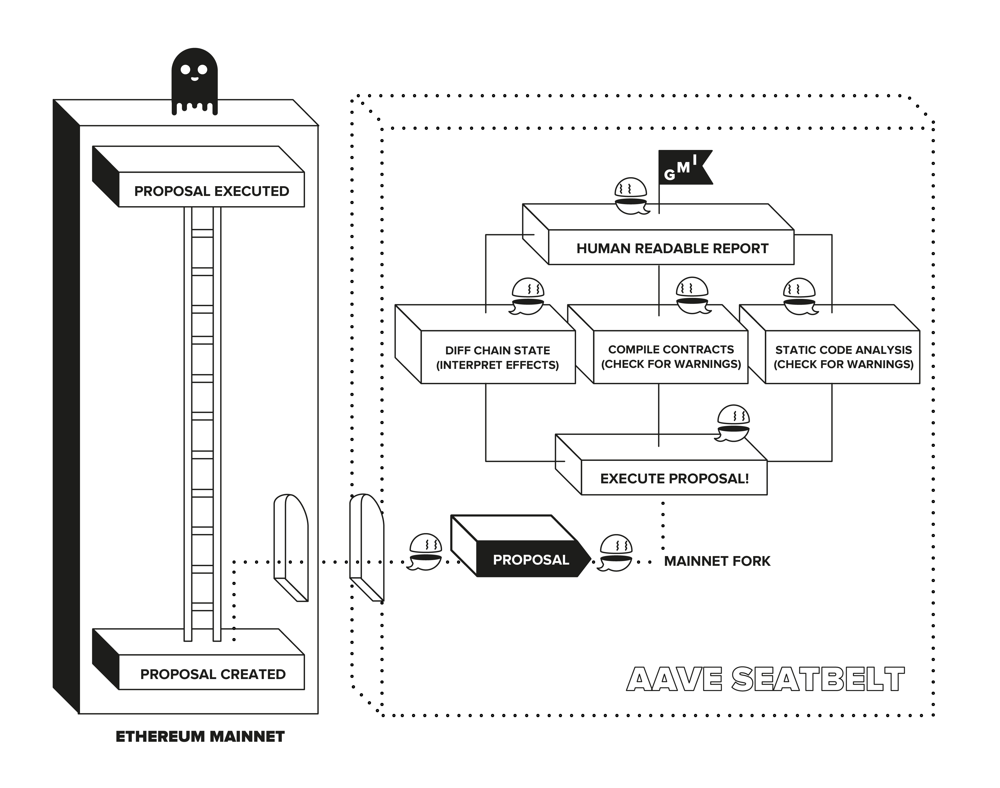

<p align="center"></a></p>

# Aave seatbelt

This repository contains tools that make on-chain governance safer,
including automated scripts that apply checks to live proposals to allow
for better informed voting.

[](https://github.com/bgd-labs/seatbelt-for-ghosts/actions/workflows/governance-checks.yaml)

## How it works

Aave Seatbelt is a tool for executing and interpreting governance simulations: it forks Ethereum mainnet (where the Aave governance lives), it simulates the execution of a proposal, and finally generates a report containing human-readable information on what effects a proposal will have.

The generated report will contain:

- All the state changes were caused by the proposal execution.
- Events triggered.
- Compilation report of all contracts affected, to check for potential warnings.
- It runs Slither (static analysis tool) over all touched contracts to find potential issues.

Some of those checks are initially generic, but in addition, we also added extra “interpretations” for particularities of the Aave ecosystem. For example, when an Aave Pool contract is affected, we can automate a deeper interpretation of the effect, making it more human-readable.



## Development

### Adding DAOs to CI

To add a DAO to CI, submit a pull request that adds the desired `DAO_NAME` and the according governance address to the `DAOs` constant in [utils/constants](https://github.com/bgd-labs/seatbelt-for-ghosts/blob/main/utils/constants.ts) and append your `DAO_NAME`
to the `matrix` section of [.github/workflows/governance-checks.yaml](https://github.com/bgd-labs/seatbelt-for-ghosts/blob/main/.github/workflows/governance-checks.yaml).

Note that only `AaveGovernanceV2` style governance are supported.

### Running Locally

First, create a file called `.env` with the following environment variables:

```sh
# URL to your node, e.g. Infura or Alchemy endpoint
RPC_URL=yourNodeUrl

# Tenderly access token
# Access token is obtained from the Tenderly UI via Account > Authorization > Generate Access Token
TENDERLY_ACCESS_TOKEN=yourAccessToken

# Tenderly project slug
# Project slug can be found in the URL of your project: https://dashboard.tenderly.co/<account>/<project_slug>/transactions
TENDERLY_PROJECT_SLUG=projectName

# Tenderly account
# Project slug can be found in the URL of your project: https://dashboard.tenderly.co/<account>/<project_slug>/transactions
TENDERLY_ACCOUNT=accountName

# Set omit cache to true if you want to force rerun all proposals
OMIT_CACHE=true

# Define the DAO name
DAO_NAME=Aave

# (Optional) Only needed when you want to run specific proposals of the selected DAO
PROPOSAL_FILTER=1_2_3
```

There are now two modes of operation:

1. Run `yarn start` to simulate and run checks on all AaveGovernanceV2 proposals for the currently selected DAO
2. Set `PROPOSAL_FILTER` to `proposalId1_proposalId2` and run `yarn start` to only run checks for the selected proposal(s).

## Reports

Find the reports [here](https://github.com/bgd-labs/seatbelt-for-ghosts/tree/main/reports) when run in CI,
or in the `reports` folder if running locally.

Some notes on the outputs of reports:

- If a transaction reverts, that will be reported in the state changes section
- State changes and events around the proposal execution process are omitted from reports to reduce noise

### Credits

_Forked of & inspired by [uniswap governance seatbelt](https://github.com/Uniswap/governance-seatbelt)_

Notable changes:

- adjusted for `AaveGovernanceV2` and ipfs proposal payloads
- storing reports right on the main branch for better discoverability
- simulations are only rerun for not previously executed & simulated proposals
- running custom simulations is handled via `PROPOSAL_FILTER` only, no need to create sim files
- the ci is chunking the proposals in different runs so they can partially run in parallel
